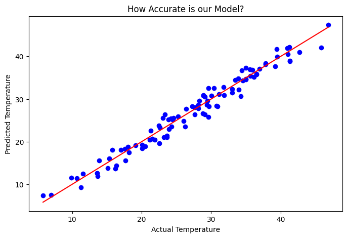

**Server Room Temperature Predictor (Linear Regression)**

## 📌 Problem Statement
Manual temperature monitoring in server rooms is reactive. 
This project uses **Machine Learning (Linear Regression)** to proactively predict room temperature based on **CPU Load** and **Fan Speed**.

## 🚀 Features
- Predictive Analytics: Foresees temperature spikes before they occur.
- Accuracy Tracking: Uses R-squared and MAE metrics to ensure reliability.
- Visual Evidence: Includes an automated plotting system to verify predictions.

## 📊 Results
Our model achieved a high accuracy score, showing that CPU Load and Fan Speed are strong predictors of thermal health in ICT infrastructure.

